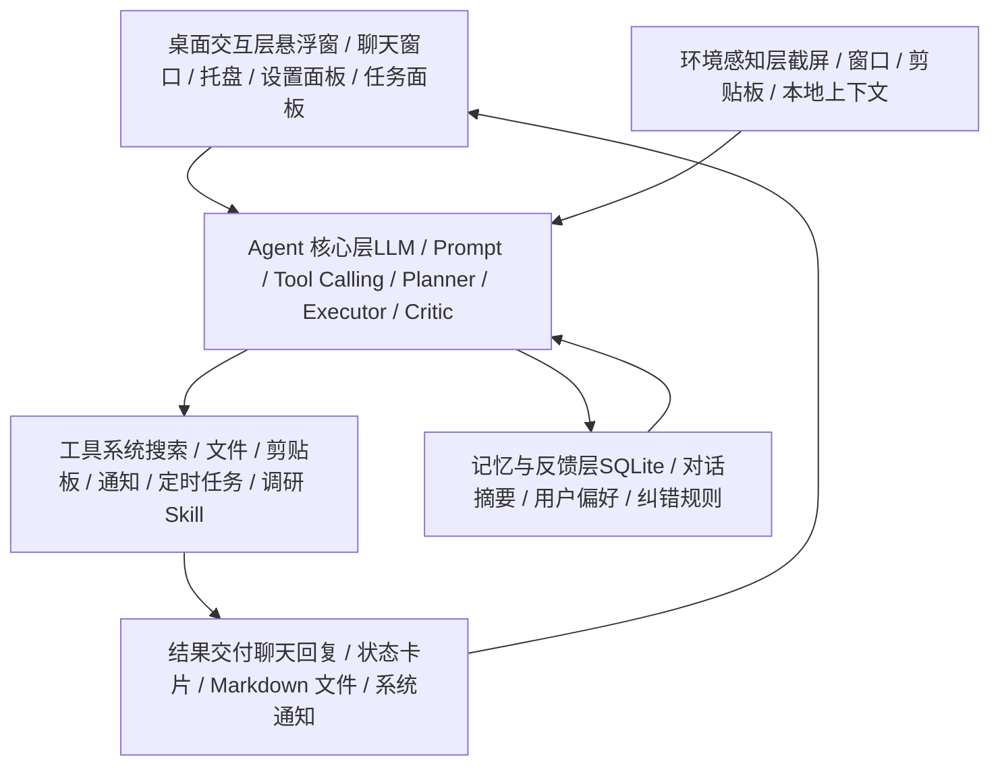

# DeskAgent-EvolveCat

一个通用桌面 Agent 产品验证项目，以高频调研任务作为首个验证场景，探索 Agent 在本地桌面环境中的任务规划、工具调用、记忆 / 上下文、后台执行、状态反馈、质量评估与结果沉淀。

> 当前项目定位是产品验证和能力原型，不是商业化产品。重点验证桌面 Agent 的产品架构、交互体验和任务执行链路。

## 为什么做这个项目

通用大模型和 Agent 工具已经很强，但在真实工作流里仍然存在几个问题：

- 长任务执行过程黑箱，用户不知道 Agent 当前在做什么。
- 工具调用、任务状态、失败原因和最终结果之间缺少清晰链路。
- 单次对话结果难以沉淀，用户偏好、历史任务和纠错经验不能稳定复用。
- 通用 Agent 不一定贴合具体工作流，例如调研计划、来源筛选、报告结构、结果归档等。

DeskAgent 的目标是验证一个桌面常驻 Agent 的产品形态：让 Agent 能在本地工作环境中理解任务、调用工具、后台执行、展示进度、沉淀记忆，并通过质量评估持续迭代。

## 产品定位

DeskAgent 是一个通用桌面 Agent 原型。

当前选择“调研”作为首个验证场景，是因为调研任务能完整检验 Agent 的关键能力：

- 目标理解
- 计划拆解
- 多轮搜索
- 工具调用
- 来源筛选
- 信息抽取
- 综合写作
- 质量审核
- 结果沉淀

这套链路跑通后，可以扩展到更多工作流：

- 竞品分析
- 文档整理
- 会议纪要
- 需求拆解
- 数据分析
- Coding 辅助
- 个人知识管理

## 核心能力

### 1. 桌面常驻入口

- PySide6 桌面悬浮窗
- 聊天窗口
- 系统托盘
- 设置面板
- 后台任务面板

桌面形态的目标是让 Agent 更接近真实工作流，而不是停留在网页聊天框里。

### 2. Agent 任务执行

- OpenAI 兼容 Chat Completions 协议
- Function Calling / Tool Calling
- 后台任务队列
- 定时任务
- 任务状态回传
- 文件读写与报告输出

长任务不会只返回一个最终答案，而是通过状态卡片和任务面板展示执行进度。

### 3. 本地记忆与反馈闭环

- SQLite 本地记忆
- 对话摘要
- 用户偏好
- 任务结果
- 用户纠错规则
- 后续对话召回

设计目标是让 Agent 能从用户反馈中逐步修正行为，而不是每次都从零开始。

### 4. Skill 化能力扩展

当前重点验证专业调研 Skill，链路包括：

```text
用户目标
  -> 任务理解
  -> 查询规划
  -> 搜索与来源筛选
  -> 正文读取
  -> 信息抽取
  -> 综合写作
  -> Critic 审核
  -> Markdown 报告输出
```

后续可以在同一套 Agent 架构上扩展更多 Skill。

### 5. 任务可观察性

Agent 执行过程中，用户可以看到：

- 当前任务
- 执行阶段
- 后台任务状态
- 工具调用结果
- 成功 / 失败状态
- 生成文件路径

这部分设计用于降低 Agent 执行黑箱感，提升用户对长任务的可控感。

## 产品架构



## 技术栈

| 模块  | 技术  |
| --- | --- |
| 桌面 UI | Python, PySide6, Qt |
| 模型接入 | OpenAI-compatible Chat Completions |
| 默认文本模型 | DeepSeek |
| 视觉模型 | Gemini Vision，可按配置启用 |
| 本地记忆 | SQLite, JSON |
| 后台任务 | QThread / QThreadPool |
| 搜索能力 | DuckDuckGo Search / Tavily |
| 语音能力 | edge-tts |
| 打包  | PyInstaller |

## 项目结构

```text
DeskAgent/
├── action/                 # 音效、TTS 等动作能力
├── agent/                  # Agent 核心、LLM、工具、任务、记忆
│   ├── llm/                # OpenAI 兼容模型客户端
│   └── memory/             # SQLite 记忆、自进化、记忆整理
├── perception/             # 截屏、窗口、剪贴板和主动感知
├── skills/                 # Skill 扩展，当前重点是专业调研
├── tools/                  # 独立工具实现
├── ui/                     # PySide6 界面
├── utils/                  # 配置、日志、平台兼容工具
├── scripts/                # 打包脚本
├── config.example.json     # 配置模板
├── requirements.txt        # Python 依赖
└── main.py                 # 应用入口
```

## 快速开始

### 1. 克隆项目

```bash
git clone https://github.com/<your-name>/<repo-name>.git
cd <repo-name>
```

### 2. 创建虚拟环境

Windows:

```powershell
py -m venv .venv
.\.venv\Scripts\activate
```

macOS / Linux:

```bash
python3 -m venv .venv
source .venv/bin/activate
```

### 3. 安装依赖

```bash
pip install -r requirements.txt
```

如需使用 Tavily 搜索能力：

```bash
pip install tavily-python
```

### 4. 配置模型

复制配置模板：

Windows:

```powershell
New-Item -ItemType Directory -Force data | Out-Null
Copy-Item config.example.json data\config.json
```

macOS / Linux:

```bash
mkdir -p data
cp config.example.json data/config.json
```

示例配置：

```json
{
  "chat": {
    "provider": "deepseek",
    "model": "deepseek-chat",
    "api_key": "YOUR_DEEPSEEK_API_KEY",
    "base_url": "https://api.deepseek.com/v1"
  },
  "vision": {
    "provider": "gemini",
    "model": "gemini-2.5-flash",
    "api_key": "YOUR_GEMINI_API_KEY"
  }
}
```

### 5. 启动应用

```bash
python main.py
```

启动后会出现桌面悬浮入口，可以通过悬浮窗或系统托盘打开聊天窗口、设置面板和任务面板。


## Q&A

### 为什么先做调研

调研不是最终边界，而是首个验证场景。它天然包含 Agent 的核心难点：目标理解、计划拆解、多工具执行、信息筛选、综合判断和质量评估。

### 为什么不直接使用成熟 Agent 产品

成熟 Agent 的通用能力很强。DeskAgent 的价值不是替代它们，而是验证一个贴近本地桌面工作流的产品层：

- 本地文件流转
- 后台任务状态
- 团队 / 个人输出口径
- 结果沉淀
- 失败日志
- 用户反馈闭环

## 当前限制

- 仍处于产品验证阶段，部分能力稳定性有限。
- 调研质量依赖搜索结果、网页读取质量和模型能力。
- 不同模型能力差异较大，例如部分文本模型不支持视觉输入。
- 当前主要验证单机桌面场景，尚未实现多人协作和云端同步。
- API Key 需要用户自行配置。

## Roadmap

- [x] 桌面悬浮入口与系统托盘
- [x] 聊天窗口与流式输出
- [x] 工具调用状态展示
- [x] 后台任务面板
- [x] 本地记忆
- [x] 专业调研 Skill 原型
- [x] Planner / Executor / Critic 架构探索
- [ ] 可编辑任务计划
- [ ] 阶段产物可视化
- [ ] 调研质量评估面板
- [ ] 更多 Skill 扩展
- [ ] MCP 工具生态接入
- [ ] 打包安装体验优化
