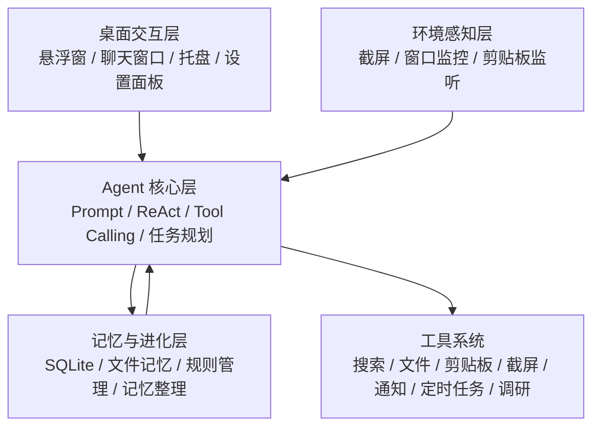

# evolve-agent-cat

`evolve-agent-cat` 是一个本地桌面 Agent 系统，围绕长期记忆、工具调用、环境感知、后台任务和用户反馈驱动的自进化机制展开。项目目标是验证桌面常驻 Agent 如何在真实工作环境中持续理解上下文、沉淀经验并稳定执行任务。

## 系统概览

当前版本处于 V2 / V2.1 迭代阶段，重点更新方向包括：

- 桌面常驻入口：基于 PySide6 的悬浮窗、聊天窗口、系统托盘和设置面板
- 对话模型接入：支持 OpenAI 兼容 Chat Completions 协议，默认配置为 DeepSeek
- 环境感知：支持截屏理解、窗口监控、剪贴板监听和主动上下文提示
- 本地记忆：基于 SQLite 与文件系统保存长期信息、对话摘要和规则数据
- 工具系统：通过 Function Calling 接入搜索、文件、剪贴板、通知、定时任务等能力
- 任务执行：支持后台任务队列、任务面板、定时任务和结果回传
- 自进化机制：从用户纠正中提炼规则，并通过记忆召回影响后续行为
- 专业调研 Skill：V2.1 新增的深度调研能力原型，可生成结构化 Markdown 报告

## 核心问题

项目主要探索三个方向：

| 方向 | 目标 |
| --- | --- |
| Agent 如何持续学习 | 将用户纠正、对话记录和任务结果沉淀为可复用的本地记忆 |
| Agent 如何建立可控性 | 让工具调用、任务进度、记忆提取和结果回传可追踪 |
| Agent 如何融入桌面环境 | 通过窗口、截屏、剪贴板等本地上下文提升任务理解能力 |

## V2 能力更新

### 桌面交互

- PySide6 桌面悬浮窗
- 系统托盘常驻
- 聊天窗口与流式输出
- 工具调用状态展示
- 任务面板与后台结果展示
- 设置面板与本地配置管理

### 记忆系统

- 短期上下文、工作记忆、长期记忆分层
- 对话后自动提取可沉淀信息
- 本地 SQLite 记忆存储
- 文件系统辅助保存工作记忆
- 记忆压缩、合并和清理流程

### 自进化流程

用户纠正会进入规则提炼流程：

```text
用户纠正
  -> 纠错信号检测
  -> 原问题 / 原回答 / 用户反馈提取
  -> 规则候选生成
  -> 冲突检查
  -> 写入工作记忆
  -> 后续对话召回验证
```

这套流程的目标不是保证模型永不出错，而是让系统能从明确反馈中逐步修正行为。

### 工具调用

当前工具通过 Function Calling 接入 Agent 循环：

- 联网搜索
- 文件读取
- 文件写入
- 剪贴板读取
- 剪贴板写入
- 截屏理解
- 系统通知
- 定时 / 周期任务
- 专业调研任务
- 受限本地命令执行

高风险工具会通过安全标记、白名单或黑名单进行限制。

### 环境感知

- 截屏感知：定期理解屏幕内容，为对话和任务提供上下文
- 窗口监控：识别前台窗口、用户活跃状态和工作场景
- 剪贴板监听：识别复制的 URL、代码或长文本内容
- 专注模式：在全屏、会议等场景减少主动打扰

### 专业调研 Skill

V2.1 正在推进专业调研能力，目标是从“搜索结果整理”升级为“带证据链的结构化研究”：

- 查询规划
- 来源筛选
- 正反观点收集
- 证据链整理
- 结论与行动建议生成
- Markdown 报告输出
- 历史调研结果复用

## 技术架构



## 技术栈

| 模块 | 技术 |
| --- | --- |
| 桌面 UI | Python, PySide6, Qt |
| 对话模型 | OpenAI 兼容 Chat Completions 协议 |
| 默认聊天模型 | DeepSeek |
| 视觉理解 | Gemini Vision |
| 记忆存储 | SQLite, JSON 文件 |
| 后台任务 | QThread / QThreadPool |
| 搜索能力 | DuckDuckGo Search / Tavily |
| 语音能力 | edge-tts |
| 打包方案 | PyInstaller |

## 快速开始

### 1. 克隆仓库

```bash
git clone https://github.com/<your-name>/evolve-agent-cat.git
cd evolve-agent-cat
```

如果你使用的是本地开发目录，也可以直接进入项目根目录后执行后续命令。

### 2. 创建虚拟环境

Windows:

```powershell
python -m venv .venv
.\.venv\Scripts\activate
```

macOS / Linux:

```bash
python3 -m venv .venv
source .venv/bin/activate
```

### 3. 安装依赖

```bash
pip install -r requirements.txt
```

如需使用 V2.1 调研工具，并且运行时提示缺少 Tavily：

```bash
pip install tavily-python
```

### 4. 配置模型

首次启动时会从 `config.example.json` 自动生成 `data/config.json`。也可以手动创建：

Windows:

```powershell
New-Item -ItemType Directory -Force data | Out-Null
Copy-Item config.example.json data\config.json
```

macOS / Linux:

```bash
mkdir -p data
cp config.example.json data/config.json
```

示例配置：

```json
{
  "chat": {
    "provider": "deepseek",
    "model": "deepseek-chat",
    "api_key": "YOUR_DEEPSEEK_API_KEY",
    "base_url": "https://api.deepseek.com/v1"
  },
  "vision": {
    "provider": "gemini",
    "model": "gemini-2.5-flash",
    "api_key": "YOUR_GEMINI_API_KEY"
  }
}
```

如果模型服务兼容 OpenAI 协议，可以替换 `base_url`、`model` 和 `api_key`。

### 5. 启动应用

```bash
python main.py
```

启动后会出现桌面悬浮入口，可通过悬浮窗或系统托盘进入聊天、设置和任务面板。

## 打包

Windows:

```bash
python scripts/build_win.py
```

macOS:

```bash
python scripts/build_mac.py
```

打包产物输出到 `dist/`。

## 项目结构

```text
evolve-agent-cat/
├── action/                 # 音效、TTS 等动作能力
├── agent/                  # Agent 核心、LLM 路由、工具、任务和记忆系统
│   ├── llm/                # OpenAI 兼容模型客户端
│   └── memory/             # SQLite 记忆、自进化、记忆整理
├── perception/             # 截屏、窗口、剪贴板和主动感知
├── skills/                 # 可扩展 Skill，当前包含专业调研原型
├── tools/                  # 独立工具实现
├── ui/                     # PySide6 界面、悬浮窗、聊天窗口、面板
├── utils/                  # 配置、日志、平台兼容工具
├── scripts/                # 打包和资源生成脚本
├── config.example.json     # 配置模板
├── requirements.txt        # Python 依赖
└── main.py                 # 应用入口
```

## 数据与隐私

- API Key 存放在本地 `data/config.json`，默认不提交到 Git
- 记忆数据默认保存在本地 `data/` 目录
- 截屏、窗口和剪贴板信息仅在本地采集，并按当前配置进入模型调用链
- 剪贴板读取会过滤疑似密码、token、secret、key 等敏感内容
- macOS 使用截屏和窗口能力时，需要授予屏幕录制 / 辅助功能权限

## 路线图

- [x] 桌面悬浮入口与系统托盘
- [x] 流式对话与聊天面板
- [x] 本地记忆存储
- [x] 工具调用链路
- [x] 截屏、窗口、剪贴板三类感知
- [x] 定时任务与后台任务面板
- [x] 自进化规则管理
- [ ] 专业调研 Skill 稳定化
- [ ] 效果评测指标面板
- [ ] MCP / Skill 生态扩展
- [ ] 更强的多模态感知
- [ ] 跨设备记忆同步
