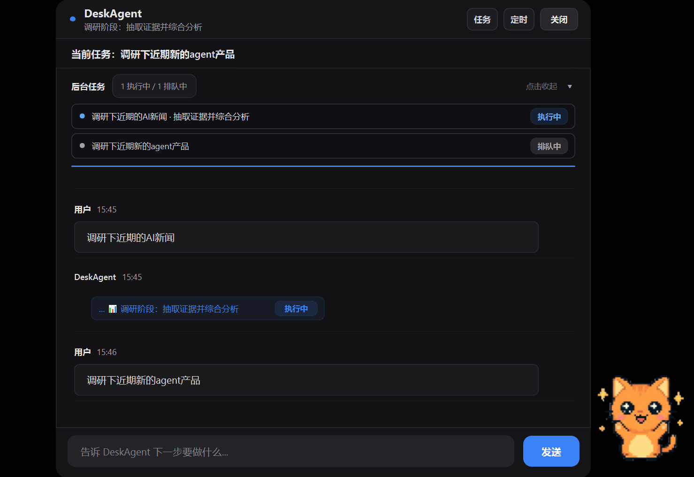
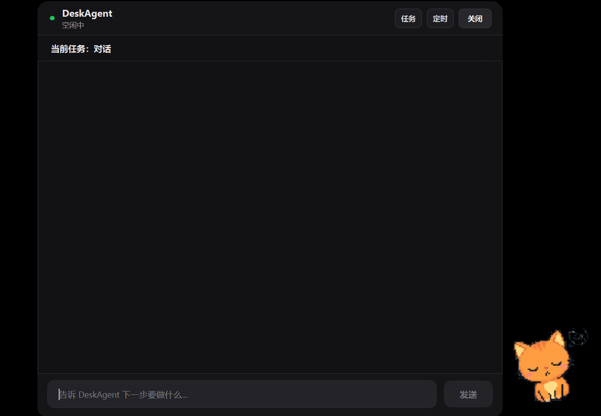
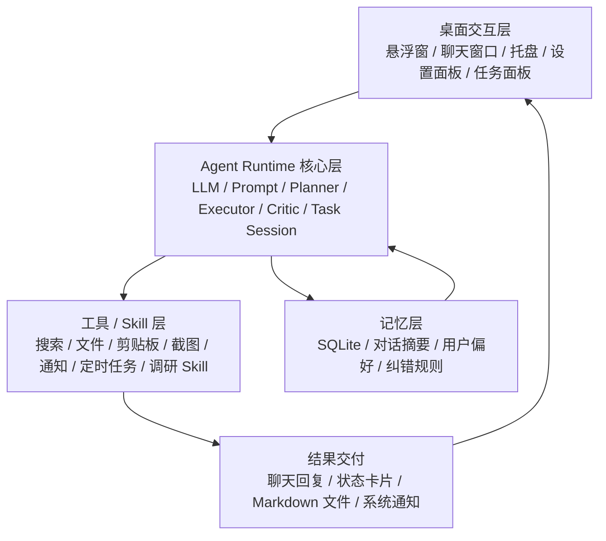

# DeskAgent

DeskAgent 是一个通用桌面 Agent 产品验证项目，面向团队内部高频调研需求设计，一期以调研任务作为首个验证和打磨场景。

项目基于 Python + PySide6 构建本地桌面 Agent，重点验证 Agent 在真实桌面工作流中的任务规划、工具调用、记忆沉淀、后台执行、状态反馈、质量评估与结果归档能力。

## 演示

- 演示视频：[点击观看 DeskAgent Demo](https://icn6dvk8k1of.feishu.cn/file/N1tMbgqYPoKVuSxTu8dc9F0dnKD)

[](https://icn6dvk8k1of.feishu.cn/file/N1tMbgqYPoKVuSxTu8dc9F0dnKD)

### 截图




## 项目定位

DeskAgent 是一个通用桌面 Agent 原型，调研只是首个验证场景，不是产品边界。

选择调研作为一期场景，是因为它能集中验证目标理解、计划拆解、多轮搜索、工具调用、来源筛选、综合写作、质量审核和结果沉淀等关键链路。

这套链路跑通后，可以继续扩展到竞品分析、文档整理、会议纪要、需求拆解、数据分析、Coding 辅助、个人知识管理等复杂长任务场景。

## 产品架构



## 核心能力

### 1. Planner / Executor / Critic 协作机制

DeskAgent 采用 Planner / Executor / Critic 三层协作思路：

- Planner：负责初始任务理解与执行路径规划。
- Executor：基于 ReAct 式循环完成“推理决策 -> 工具调用 -> 结果观察”的闭环迭代。
- Critic：负责最终质量审核与问题识别。

当前已实现阶段性产物沉淀和最终 Critic 审核。下一步计划将 Critic 前置到执行过程中，在发现任务路径偏离、关键信息缺失、工具调用连续失败或输出不符合规范时，触发 Planner 动态重规划。

### 2. ReAct 式任务执行

DeskAgent 的 Executor 采用 ReAct 式循环推进任务：

```text
Thought  推理下一步要做什么
Action   调用工具 / Skill 执行动作
Observation  观察工具返回结果
Repeat   继续下一轮推理或输出最终结果
```

当前已跑通：

- OpenAI 兼容 Chat Completions 协议
- Function Calling / Tool Calling
- 工具调用状态回传
- 后台任务队列
- 定时任务
- 文件读写与报告输出
- 任务结果回传

长任务不会只返回一个最终答案，而是通过状态卡片和任务面板展示执行进度，降低 Agent 执行黑箱感。

### 3. Skill 化能力扩展

当前重点验证专业调研 Skill，链路包括：

```text
用户目标
  -> 任务理解
  -> 查询规划
  -> 搜索与来源筛选
  -> 正文读取
  -> 信息抽取
  -> 综合写作
  -> 最终 Critic 审核
  -> Markdown 报告输出
```

后续可以在同一套 Agent 架构上扩展更多 Skill。

### 4. 本地记忆与反馈闭环

- SQLite 本地记忆
- 对话摘要
- 用户偏好
- 任务结果
- 用户纠错规则
- 后续对话召回

设计目标是让 Agent 能从用户反馈中逐步修正行为，而不是每次都从零开始。

### 5. 任务可观察性

Agent 执行过程中，用户可以看到：

- 当前任务
- 执行阶段
- 后台任务状态
- 工具调用结果
- 成功 / 失败状态
- 生成文件路径

这部分设计用于提升用户对长任务的可控感和信任感。

### 6. 桌面常驻入口

- PySide6 桌面悬浮窗
- 聊天窗口
- 系统托盘
- 设置面板
- 后台任务面板
- 定时任务面板

桌面形态的目标是让 Agent 更接近真实工作流，而不是停留在网页聊天框里。

## 技术栈

| 模块 | 技术 |
| --- | --- |
| 桌面 UI | Python, PySide6, Qt |
| 模型接入 | OpenAI-compatible Chat Completions |
| 默认文本模型 | DeepSeek |
| 视觉模型 | Gemini Vision，可按配置启用 |
| 本地记忆 | SQLite, JSON |
| 后台任务 | QThread / QThreadPool |
| 搜索能力 | DuckDuckGo Search / Tavily |
| 语音能力 | edge-tts |
| 打包 | PyInstaller |

## 项目结构

```text
DeskAgent/
├── action/                 # 音效、TTS 等动作能力
├── agent/                  # Agent 核心、LLM、工具、任务、记忆
│   ├── llm/                # OpenAI 兼容模型客户端
│   ├── memory/             # SQLite 记忆、自进化、记忆整理
│   ├── runtime/            # Workflow、TaskSession、进度与产物管理
│   └── workflows/          # 可扩展工作流
├── perception/             # 截屏、窗口、剪贴板和主动感知
├── skills/                 # Skill 扩展，当前重点是专业调研
├── tools/                  # 独立工具实现
├── ui/                     # PySide6 界面
├── utils/                  # 配置、日志、平台兼容工具
├── scripts/                # 打包脚本
├── config.example.json     # 配置模板
├── requirements.txt        # Python 依赖
└── main.py                 # 应用入口
```

## 快速开始

### 1. 克隆项目

```bash
git clone https://github.com/ln872790057/DeskAgent-EvolveCat.git
cd DeskAgent-EvolveCat
```

### 2. 创建虚拟环境

Windows:

```powershell
py -m venv .venv
.\.venv\Scripts\activate
```

macOS / Linux:

```bash
python3 -m venv .venv
source .venv/bin/activate
```

### 3. 安装依赖

```bash
pip install -r requirements.txt
```

如需使用 Tavily 搜索能力：

```bash
pip install tavily-python
```

### 4. 配置模型

复制配置模板：

Windows:

```powershell
New-Item -ItemType Directory -Force data | Out-Null
Copy-Item config.example.json data\config.json
```

macOS / Linux:

```bash
mkdir -p data
cp config.example.json data/config.json
```

示例配置：

```json
{
  "chat": {
    "provider": "deepseek",
    "model": "deepseek-chat",
    "api_key": "YOUR_DEEPSEEK_API_KEY",
    "base_url": "https://api.deepseek.com/v1"
  },
  "vision": {
    "provider": "gemini",
    "model": "gemini-2.5-flash",
    "api_key": "YOUR_GEMINI_API_KEY"
  }
}
```

### 5. 启动应用

```bash
python main.py
```

启动后会出现桌面悬浮入口，可以通过悬浮窗或系统托盘打开聊天窗口、设置面板和任务面板。

## 典型使用场景

### 场景 1：行业调研

用户输入：

```text
调研一下 Cursor 和 Claude Code 的区别
```

Agent 执行：

- 理解调研目标
- 拆分子问题
- 搜索和读取来源
- 筛选高质量信息
- 生成结构化报告
- 输出 Markdown 文件

### 场景 2：后台任务跟进

用户发起长任务后，可以在任务面板中查看：

- 当前执行阶段
- 已完成任务
- 失败任务
- 任务结果

### 场景 3：个人工作流沉淀

Agent 可以通过本地记忆沉淀用户偏好、任务结果和纠错规则，为后续任务提供上下文。

## 验证进展

围绕调研、文件输出、工具调用、后台任务、定时任务、错误恢复等链路，项目已完成 100+ 次完整任务验证。这里的验证次数不是商业化用户规模，而是产品验证过程中的真实使用、测试样例和 badcase 复盘。

当前重点验证内容：

- 长任务是否能稳定跑完
- 用户是否能看懂 Agent 正在做什么
- 工具调用失败时是否能暴露原因
- 调研结果是否能沉淀为可复用文件
- Critic 是否能识别低质量输出
- badcase 是否能推动下一轮架构和体验优化

## 当前限制

- 仍处于产品验证阶段，部分能力稳定性有限。
- 调研质量依赖搜索结果、网页读取质量和模型能力。
- 不同模型能力差异较大，例如部分文本模型不支持视觉输入。
- 当前主要验证单机桌面场景，尚未实现多人协作和云端同步。
- API Key 需要用户自行配置。

## Roadmap

- [x] 桌面悬浮入口与系统托盘
- [x] 聊天窗口与流式输出
- [x] 工具调用状态展示
- [x] 后台任务面板
- [x] 本地记忆
- [x] 专业调研 Skill 原型
- [x] Planner / Executor / Critic 架构探索
- [x] 100+ 次任务验证与 badcase 复盘
- [ ] 可编辑任务计划
- [ ] 阶段 Critic 校验与 Planner 动态重规划
- [ ] 阶段产物可视化
- [ ] 调研质量评估面板
- [ ] 更多 Skill 扩展
- [ ] MCP 工具生态接入
- [ ] 打包安装体验优化
